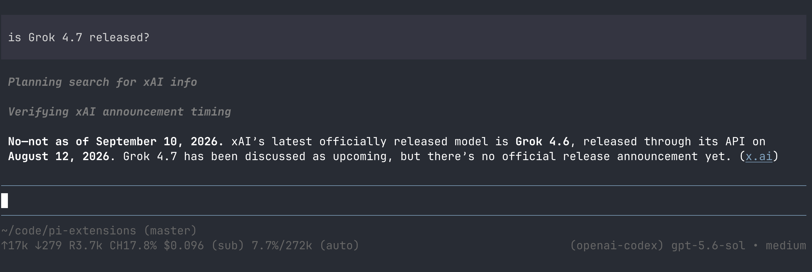

# pi-extensions

Custom extensions for Pi.

## `openai-codex-web-search`

Adds the `web_search` server tool to requests sent through the `openai-codex` provider, enabling supported models to search the web. Searches exclude results from `csdn.net`.

### Compatibility

- Tested with `gpt-5.6-sol`.
- Earlier models may not support the `web_search` tool.

### Reference

See the [OpenAI web search documentation](https://developers.openai.com/api/docs/guides/tools-web-search?api-mode=responses#).

### example
