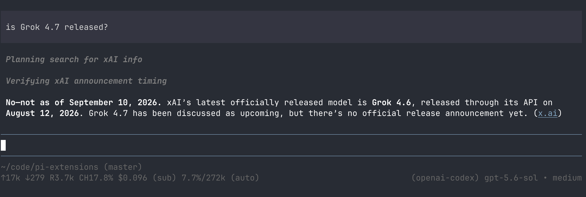

# pi-extensions

Custom extensions for Pi.

## Multi-host SSH diagnostics

Start a TUI session with the multi-host SSH extension and OpenSSH config aliases:

```sh
pi -e ./extensions/ssh-multi-host/index.ts --ssh-hosts 'app=application server;db=database server'
```

The extension checks every target before enabling local `read` and `bash` plus
`remote_read` and `remote_bash`. Remote calls name their target explicitly. It
stores the verified inventory in the session, so resuming needs no flag. A
saved inventory takes precedence if the flag is supplied again. Configure keys
and trusted host keys with OpenSSH before starting; SSH is non-interactive.

Run its deterministic fake-SSH tests with:

```sh
node --test extensions/ssh-multi-host/test/ssh-multi-host.test.mjs
```

SSH cancellation and timeout stop the local client; a remote process may still
be running.

## `openai-codex-web-search`

Adds the `web_search` server tool to requests sent through the `openai-codex` provider, enabling supported models to search the web. Searches exclude results from `csdn.net`.

### Compatibility

- Tested with `gpt-5.6-sol`.
- Earlier models may not support the `web_search` tool.

### Reference

See the [OpenAI web search documentation](https://developers.openai.com/api/docs/guides/tools-web-search?api-mode=responses#).

### example


## System prompt writer

`extensions/system-prompt-writer.ts` writes the effective system prompt immediately before
each agent run. This captures prompt changes made by other extensions before the
prompt is sent to the LLM.

```bash
pi -e ./extensions/system-prompt-writer.ts
```

By default, it writes a separate `*.system-prompt.md` file next to each Pi
session's JSONL file. For sessions without a persistent session file, it writes
`.pi-system-prompt.md` in the working directory.

Use a fixed output path with:

```bash
pi -e ./extensions/system-prompt-writer.ts --system-prompt-output /tmp/system-prompt.md
```

Relative output paths are resolved from Pi's working directory. The file is
overwritten on each agent run so it always contains the latest effective prompt.
Treat the output as sensitive because it can contain loaded project instructions
and local paths.
